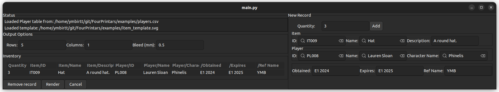
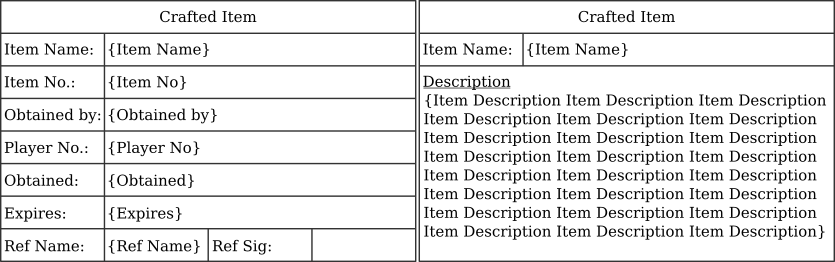

# Four Printars

An Inkscape extension to make lammie-making for LARPs a billion times easier.

Four Printars is powered by templates, defining both the look of the finished
lammie, and the data that should go on that lammie. It pulls data from CSV
files, exported from whatever database backs the LARP, asks the user what data
should go on the loaded template, then neatly arranges filled-in copies of the
templates onto pages for printing.

## Installation

This is an Inkscape extension. It was designed against Inkscape 1.3, but will
probably work with more modern versions.

You can download Inkscape for whatever platform you use
[here](https://inkscape.org/release/1.3/).

To install this extension, open up Inkscape and go to Edit > Preferences >
System > User Extensions. Click the "open" button next to the directory,
download this repo as a zip file using the button in GitHub, and unpack the zip
archive directly into that directory.

Restart Inkscape. If you've put it in the right place, you should see Four
Printars appear under Extensions > Four Pillars.

## Using an Example

The best way to see what's going on with Four Printars is to play around with
the sample. You can see it in action [here](https://www.youtube.com/watch?v=lhN2iSQlsp4).

Before you start, open up the examples directory and take a quick look at
`item_template.svg`, `items.csv` and `players.csv`. `item_template.svg` defines
roughly what your finished lammies will look like. It's a slightly special svg
file, and we'll talk about how to make your own later.

`items.csv` and `players.csv` are CSV-format tables containing all the items and
players that exist in our example game. You can open them in Excel and take a
look if you'd like. Most spreadsheet software will let you export things as CSV
files very easily - if you ask nicely, I might add support for directly reading
`.xlsx` files, or maybe direct from Google sheets, but that's going to be a fair
chunk of work.

Once this extension is installed, open up inkscape. Create an empty drawing of
the page size you'd like to print to - probably A4.

Click "Extensions > Four Pillars > Four Printars". Note that while the extension
is running, Inkscape itself will become unresponsive and your OS might complain
about this. The extension still works fine, and Inkscape will spring back to
life when you're done.

First, you'll be prompted for an SVG template file. Find
`examples/item_template.svg` and load it.

Now you'll be prompted for the Item table - that's `items.csv`. Finally, the
Player table - `players.csv`. You'll then be taken to the main interface, which
confirms the tables you've just loaded

You can prepare a batch of lammies using the controls on the right. If you start
searching for an item and a player, you can select one of the suggestions to
fill in all the other fields automatically. You can also fill in the Obtained,
Expires and Ref Name fields as you like. Finally, fill in the Quantity field
with how many copies of that lammie you'd like, then hit "Add". You should see
it appear in the inventory on the left.

Do this as much as you like for as many lammies as you like. When you're ready,
fill in the "Rows", "Columns" and "Bleed" fields. The "Rows" and "Columns"
fields specify how many copies of the template you want on each page. I happen
to like using 5 rows and 1 column for this template. Note that Four Printars
won't try to stop you using crazy options that won't fit properly here.

The "Bleed" field controls how much space will be left between lammies. It's a
lot easier to cut your lammies out after printing if you leave a couple of mm
between each one.

When everything's set up correctly, hit the "Render" button, then close the
extension. You should see a number of new pages in your SVG containing your
rendered lammies! You can now print this off and cut them out.

Of course, these are random lammies for a LARP that doesn't exist. You want to
do this for your LARP. To do that, you'll need to build your own templates.

## Building Templates

### Build your basic layout

Four Printars templates are mildly special SVG files, and SVG files are just a
type of image file. You can make them easily enough directly through Inkscape.

First, use the normal Inkscape tools to build something that looks like your
lammie. Add some placeholder text to all the fields you want Four Printars to
fill in for you:

Sometimes, you'll want to have multi-line text containing, say, a long-form item
description. For these, you should create a text object, and a box that the text
should stay inside. Select both of them in Inkscape, then use "Text > Flow into
Frame" to make sure it stays contained:

Once you've got everything laid out how you want it, be sure to neaten it up.
Use "File > Document Properties > Resize to Content" to shrink the document to
fit your lammie snugly - this bounding box is used to tile your lammies across a
printer sheet, so making it snug is important.

### Identify which fields Four Printars should fill in

Now it's time to modify your placeholder fields so that Four Printars can find
them and fill them in.

For each placeholder, click it, and press Ctrl+Shift+X to open up the XML
editor. You need to add two attributes to each placeholder field, like this:

`data-fp-value` tells Four Printars how it should find the value that ends up
in the field. It should be formatted as `{Table}/{Column}`. For instance, if
have an item table, and that table has a column headed "Item Name", which you
want to put on your lammies, you should set `data-fp-value` to `Item/Item Name`.

`data-fp-type` determines how you want to select the relevant field. You can set
it to one of the following values:

| Value | Meaning |
| ----- | ------- |
| `key` | You want to search using this field, and selecting it should update all the other fields. Multiple keys per table are allowed. You might use this for something like a magic item's name | 
| `editable` | You want this field to be updated by a key field, but also want to be able to edit it via the interface before rendering. You might use this for something like an item's description if you want some magic item to be broadly similar to others, but with the option to make subtle tweaks |
| `displayonly` | You want this field to be updated by a key field. You want to be able to see it, but don't want to be able to edit it before rendering. You might use this for something like an item's cost, which you want to be very consistent between printings |
| `hidden` | You want this field to be updated by a key field quietly in the background. You don't want to see it at all in the interface, and only want to see it in the rendered output. You might use this for something like a player's stats, where listing every level in every skill would just clutter the UI |

If you want some examples, you can open `item_template.svg` in Inkscape, click
on some of the placeholders and hit Ctrl+Shift+X to see what correct XML should
look like.

### Hints and Tricks

If you're pulling multiple fields from the same table, you'll need to use the
same table name in every `data-fp-value` attribute. Make sure you don't, for
instance, flip between `Item/Item Name` and `Items/Description`.

If you'd like, you can omit the table entirely. If you set `data-fp-value` to,
for instance, `/Expiry`, Four Printars will prompt you for an expiry date for
each of your lammies, without attempting to read it from any input files.

You might also want a field to be visible to you while editing the lammie, but
not appear in the render. For instance, if you want your Item lammie to have
a player ID on it, but don't want any other player fields to appear, it might
help you to be able to search on the player's name. In this case, you can create
a placeholder, set the `data-fp-value` and `data-fp-type` fields as you like,
then make the placeholder invisible. Four Printars can still see it, but it
won't appear in your output.
